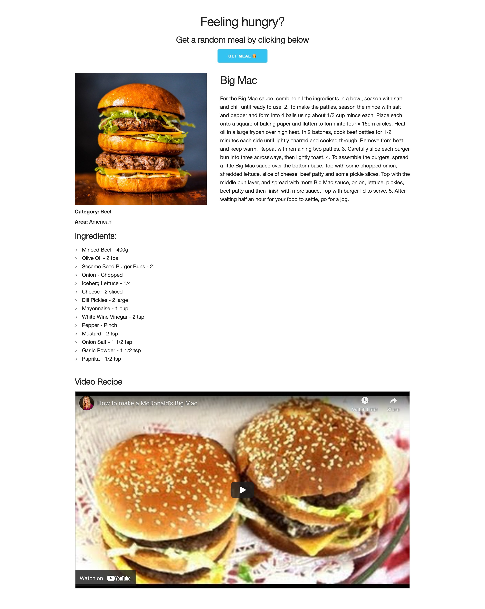

# Random Meal Generator

### About the application

The purpose of this application is to create a simple project based on JavaScript and CSS. The application generates random meal recipes from around the world. Application is ready to use each time under this [LINK](https://a-dubaj.github.io/RandomMeal/).

### Use Case

- When choosing the **GET MEAL** button, application displays a random recipe each time
- Support ***TheMealDB API***
- Display meal image, ingredients, instructions, and video recipe (if available)
- Show meal category, cuisine area, and tags

### Technology

- HTML5
- CSS3
- JavaScript (ES6)
- TheMealDB API
- Skeleton CSS Framework
- Font Awesome

### Installation

1. Clone the repository:
```bash
git clone https://github.com/a-dubaj/RandomMeal.git
```

2. Open `index.html` in your browser

No additional setup required - just open and use!

### Project Structure
```
RandomMeal/
├── index.html
├── script.js
├── style.css
├── assets/
│   └── image.png
└── README.md
```

### Application



### Features

- Random meal generation
- Ingredient list with measurements
- Step-by-step cooking instructions
- Embedded YouTube video recipes
- Responsive design
- Clean and simple interface

### API Documentation

This project uses [TheMealDB API](https://www.themealdb.com/api.php)
- Endpoint: `https://www.themealdb.com/api/json/v1/1/random.php`
- Method: GET
- Free to use

### Future Improvements

- Add loading spinner
- Error handling for API failures
- Search by ingredients
- Filter by category
- Save favorite meals
- Dark mode support

### License

Open source - feel free to use and modify

### Author

[Andrzej Dubaj](https://github.com/a-dubaj)